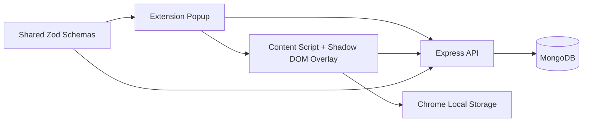

# Mini Apty

**MERN stack** (MongoDB, Express, React, Node.js) Chrome extension + REST API — TypeScript strict.

| Component | Package | Deploy target |
|-----------|---------|---------------|
| API | `packages/backend` | [Vercel](DEPLOYMENT.md#2-deploy-api-to-vercel-recommended) · [Render](DEPLOYMENT.md#3-deploy-api-to-render-alternative) |
| Database | MongoDB Atlas M0 | Free cloud cluster |
| Extension | `packages/extension` | GitLab CI artifact → Chrome Load unpacked |
| Shared types | `packages/shared` | Built as dependency |

**Full deploy guide:** [DEPLOYMENT.md](./DEPLOYMENT.md)

---

## Quick start (local)

```bash
docker compose up -d
cp .env.example .env
pnpm install
pnpm dev:backend
pnpm dev:extension    # or: pnpm build:extension
```

Load `packages/extension/dist` in `chrome://extensions`.

---

## Production build

```bash
# 1. Deploy API (set env vars on Vercel/Render — see DEPLOYMENT.md)
# 2. Build extension against live API
VITE_API_BASE_URL=https://your-api.vercel.app pnpm build:extension
```

---

## Commands (matches take-home PDF)

```bash
pnpm install
docker compose up -d
pnpm --filter backend dev
pnpm --filter extension build   # → packages/extension/dist
pnpm test:backend
```

---

## Stack

- **MongoDB** — walkthroughs + users (Atlas in prod, Docker locally)
- **Express** — JWT auth, RBAC (`author`/`admin`), owner-scoped CRUD, Zod validation
- **React** — MV3 popup + Shadow DOM preview overlay
- **Zustand + Zod** — extension state and shared schemas
- **Element targeting** — stable attrs → anchor path → XPath → fingerprint + MutationObserver

See [DEPLOYMENT.md](./DEPLOYMENT.md) for GitLab CI, Vercel, and Render setup.

---

## Architecture

Mini Apty is split into four workspace packages:

- `packages/extension` — Chrome Manifest V3 extension with React popup, content script, and service worker.
- `packages/backend` — Express REST API with JWT auth, RBAC, owner-scoped walkthrough CRUD, and MongoDB persistence.
- `packages/shared` — Zod schemas and TypeScript types shared by extension and backend.
- `packages/web` — small Vite React landing/demo frontend for Vercel deployment.

The extension is the primary product surface. The popup handles login, author controls, saved walkthroughs, and preview launch. The content script runs on host pages and mounts author/preview experiences. The backend is the source of truth for users and walkthroughs; extension storage is a cache for offline playback and progress.



## MV3 Design

The extension uses a Manifest V3 service worker instead of a background page. Long-lived UI state is not stored in the service worker because MV3 can suspend it. Instead:

- Auth state and cache live in Chrome storage through Zustand persistence.
- The popup starts author/preview flows by messaging the active tab.
- The content script owns page-level behavior because it is closest to the DOM.
- Popup-to-tab messaging failures are caught and shown as clear UI errors when the content script is unavailable, such as on a stale tab or unsupported page.

This keeps the architecture resilient to MV3 lifecycle constraints while still preserving a small service-worker footprint.

## Element Targeting Strategy

A brittle selector like `div > div:nth-child(3)` is not enough for modern SPAs. Mini Apty captures several strategies for each target:

1. Stable attributes: `data-testid`, `data-test`, `data-cy`, `data-qa`, `name`, `aria-label`, `id`.
2. Semantic metadata: tag name, role, text snippet, placeholder, type, href.
3. Anchor + relative path: find a stable parent and resolve the target relative to it.
4. XPath fallback: useful when selectors fail after DOM movement.
5. Fingerprint scoring: searches same-tag candidates and scores matching attributes/text/ARIA.
6. MutationObserver: re-resolves targets after SPA route changes, re-renders, or delayed loading.

Tradeoff: this strategy is more complex than storing a single selector, but it survives many common SPA changes without requiring control over the host app. It still cannot guarantee perfect targeting when the host page removes all stable semantics or changes the UI copy completely.

## Author And Preview Flow

Author mode:

1. User signs in from the popup.
2. User starts recording on the active HTTP(S) tab.
3. Content script highlights hovered elements and captures clicked targets.
4. Popup lets the author edit title, description, path pattern, and advance trigger.
5. Save writes to MongoDB through the API and caches the walkthrough in extension storage.

Preview mode:

1. User selects a saved walkthrough.
2. Content script tries network-first load from the backend.
3. If the backend is unavailable, cached walkthrough data is used when available.
4. The overlay renders inside Shadow DOM to avoid host-page CSS clashes.
5. Progress is saved to Chrome storage so refresh/navigation can resume from the last step.

## Backend Auth, RBAC, And Authorization

The backend exposes:

- `POST /auth/signup`
- `POST /auth/login`
- `POST /auth/forgot-password`
- `POST /walkthroughs`
- `GET /walkthroughs?origin=...&path=...`
- `GET /walkthroughs/:id`
- `PUT /walkthroughs/:id`
- `DELETE /walkthroughs/:id`

Authentication uses email/password with bcrypt hashes and JWTs. Authorization has two layers:

- Authentication failures return `401`.
- Ownership or role failures return `403`.

Roles:

- `author` — default role; can only manage owned walkthroughs.
- `admin` — assigned at signup when email is listed in `ADMIN_EMAILS`; can manage walkthroughs across owners.

The challenge only requires owner-scoped authorization, but RBAC is included to make admin/demo flows explicit.

## Error Handling And Network Tolerance

The extension has:

- React error boundary around the overlay.
- API error normalizer that distinguishes network, auth, validation, and unknown errors.
- User-visible messages in the popup.
- Cache fallback for preview when the backend is unreachable after a walkthrough was previously loaded.

Queued writes are intentionally not implemented. For this challenge, failed writes return a clear error instead of silently retrying because duplicate or stale authoring writes would require conflict handling.

## Hardest Decision

The hardest decision was how much targeting logic to build for a small challenge. A single selector would be faster, but it would fail the core product problem: third-party SPAs re-render and change structure. I chose a layered target model with stable attributes, anchors, XPath, fingerprints, and mutation observation. The tradeoff is added implementation complexity, but it better reflects the real DAP problem and gives clear extension points for future heuristics.

## Improvement Scope

- Add queued offline writes with conflict resolution.
- Add route-level tests for every error branch and validation case.
- Add email provider integration for real password-reset delivery.
- Add visual differentiation for all API error kinds in the popup.
- Add stronger admin/user management endpoints instead of `ADMIN_EMAILS`.
- Add Playwright or Chrome extension E2E tests for author/preview flows.
- Add selector confidence scoring UI so authors can see whether a target is stable.

## Interview / Demo Talking Points

- Demo signup/login, author mode, save, preview, refresh, and resume progress.
- Explain why the content script owns DOM interaction and the service worker stays small.
- Walk through selector fallback order and MutationObserver behavior.
- Show 401 vs 403 behavior and RBAC owner/admin difference.
- Explain MongoDB connection reuse for Vercel/serverless.
- Call out limitations: no queued writes, password reset is demo-only (email + new password, no verification email), and DOM targeting is heuristic rather than guaranteed.
